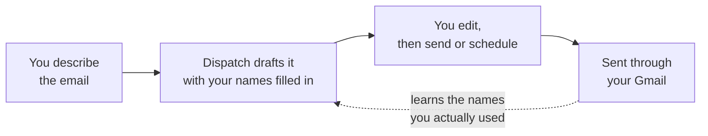

<p align="center">
</p>

<h1 align="center">Dispatch</h1>

<p align="center"><strong>Your inbox, minus the typing.</strong></p>

<p align="center">
An AI mail client that writes your email, summarises what lands, sends on your
schedule &mdash; and works directly on the Gmail account you already have.
</p>

---

## The problem

The average professional writes the same email a hundred times a year. *Chase
the invoice. Follow up on the proposal. Ask for the numbers. Decline politely.*
Then they read fifty more that could have been three lines.

Every minute of that is a minute not spent on the work the email is about.

## What Dispatch does about it

**Describe the email. Get the email.** Type "ask Priya for the Q3 numbers, we
need them by Friday" and Dispatch returns a finished subject line and a
complete, professional body, signed with your actual name. Edit it or send it.

**Read the summary, not the thread.** Any message collapses to two sentences, or
to a structured brief with key points, action items and sentiment. Decide in
five seconds whether it needs you.

**It learns who you write to.** Most AI drafting tools hand back `[Your Name]`

**And it's still a real mail client.** Inbox, Sent, Drafts, custom folders,
Gmail labels, search, bulk actions, read-later, attachments, light and dark
themes. Plus a side rail of to-do lists and notes you can pin over the inbox
while you work.

---

## Why it's different

| | Typical AI email add-on | Dispatch |
|---|---|---|
| Where your mail lives | copied into a third-party service | **stays in your Gmail** |
| Names in drafts | `[Your Name]` placeholders, forever | learned from mail you send, filled in automatically |
| Scope | a compose box bolted onto your inbox | a full mail client &mdash; read, write, file, schedule |
| Sign-up | new account, new password | your Google account, standard OAuth |
| Where it runs | someone else's servers | yours &mdash; self-host the whole thing |

Nothing is mirrored to an external mail service. Dispatch signs in with Google
OAuth 2.0 + PKCE, holds credentials in a server-side session, and talks to the
Gmail API on your behalf. You can run the entire stack on your own machine or
your own infrastructure with one command.

---

## How it works



1. **Sign in** with Google. No new account, no new password.
2. **Describe** the email you want, in a sentence.
3. **Review** the draft &mdash; subject and body, already addressed correctly.
4. **Send** now, or schedule it. Dispatch quietly gets better at step 2 each time.

Incoming mail runs the same loop in reverse: open a message, get a summary, move on.

---

## What's in it

**Mail** &mdash; Inbox, Sent, Drafts, Scheduled, custom folders and Gmail labels ·
search across sender and subject · unread and read-later filters · bulk delete,
move and mark · sender avatars · sanitised HTML reading pane · attachments ·
save as Gmail draft · delete to Gmail Trash.

**AI** &mdash; one-line prompt to full email · remembered sender and recipient
names · brief or detailed summaries of any message · a standalone summariser
page · powered by Llama 3.1 8B Instruct.

**Scheduling** &mdash; pick a send time, cancel any time before it fires.

**Workspace** &mdash; pinnable to-do lists built from headers, checklists and
bullets, floating over the inbox as draggable cards · free-form notes ·
everything remembered between sessions.

**Made yours** &mdash; light and dark themes, theme and panel colours, four font
families, four text sizes, ten notification sounds, silent hours. Saved against
your Google account, so your setup follows you.


---

## Run it yourself

You need Docker, a Google Cloud OAuth client, and a Hugging Face token with
access to Llama 3.1 8B Instruct.

**1. Google OAuth.** In Google Cloud Console create an OAuth 2.0 Web client,
enable the Gmail API, and add `http://localhost:5000/oauth2callback` as an
authorised redirect URI. The app requests `gmail.send`, `gmail.readonly` and
`gmail.modify`.

**2. Environment files.** Three of them:

`.env` in the repo root — Postgres credentials for the `db` service:

```bash
POSTGRES_USER=dispatch
POSTGRES_PASSWORD=change-me
POSTGRES_DB=dispatch
```

`backend/.env`:

| Variable | What it is |
|---|---|
| `GOOGLE_CLIENT_ID` / `GOOGLE_CLIENT_SECRET` | from step 1 |
| `REDIRECT_URI` | `http://localhost:5000/oauth2callback` |
| `FRONTEND_URL` | where to land after sign-in, e.g. `http://localhost:3000/generate` |
| `ALLOWED_ORIGINS` | comma-separated origins allowed to call the API, e.g. `http://localhost:3000` |
| `DATABASE_URL` | `postgresql+psycopg2://dispatch:change-me@db:5432/dispatch` |
| `FLASK_SECRET_KEY` | any long random string; it signs the session cookie |
| `HF_API_TOKEN` | Hugging Face inference token |

`frontend/.env.local`:

```bash
NEXT_PUBLIC_API_BASE_URL=http://localhost:5000
INTERNAL_API_BASE_URL=http://backend:5000
```

`NEXT_PUBLIC_API_BASE_URL` is what the browser calls; `INTERNAL_API_BASE_URL` is
what server-side rendering calls inside the Docker network.

**3. Start it.**

```bash
docker compose up --build
```

Frontend on `http://localhost:3000`, API on `http://localhost:5000`, Postgres on
`5432`. `GET /health` tells you the backend is up. Sessions live in a named
volume, so a rebuild does not log you out.

### Without Docker

```bash
# backend
cd backend && pip install -r requirements.txt && python main.py

# frontend
cd frontend && pnpm install && pnpm dev
```

Point `DATABASE_URL` at a Postgres you are running yourself, and swap `db` for
`localhost` in it.

### Tests

```bash
pip install -r backend/requirements-dev.txt
pytest
```

---

## Built with

**Frontend** — Next.js (App Router) and TypeScript, Tailwind CSS, Radix UI
primitives, pnpm.

**Backend** — Flask with server-side filesystem sessions, SQLAlchemy over
Postgres, the Gmail API through `google-api-python-client`, Google OAuth 2.0 with
PKCE, and Llama 3.1 8B Instruct via Hugging Face inference. Served by gunicorn.

**Infrastructure** — Docker Compose runs frontend, backend and Postgres on one
network. The backend runs a single gunicorn worker on purpose: its rate limiter
and response cache are in-process, so scaling out means moving both to Redis
first.
