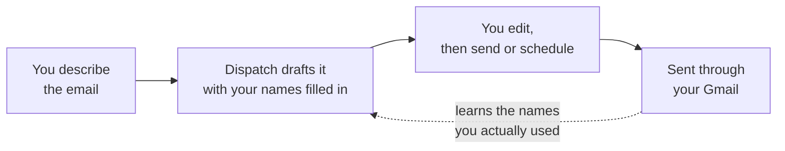

<p align="center">
</p>

<h1 align="center">Dispatch</h1>

<p align="center"><strong>Your inbox, minus the typing.</strong></p>

<p align="center">
An AI mail client that writes your email, summarises what lands, sends on your
schedule &mdash; and works directly on the Gmail account you already have.
</p>

---

## The problem

The average professional writes the same email a hundred times a year. *Chase
the invoice. Follow up on the proposal. Ask for the numbers. Decline politely.*
Then they read fifty more that could have been three lines.

Every minute of that is a minute not spent on the work the email is about.

## What Dispatch does about it

**Describe the email. Get the email.** Type "ask Priya for the Q3 numbers, we
need them by Friday" and Dispatch returns a finished subject line and a
complete, professional body, signed with your actual name. Edit it or send it.

**Read the summary, not the thread.** Any message collapses to two sentences, or
to a structured brief with key points, action items and sentiment. Decide in
five seconds whether it needs you.

**It learns who you write to.** Most AI drafting tools hand back `[Your Name]`
and `[Manager's Name]` and leave you to fill in the blanks &mdash; every single
time. Dispatch reads the greeting and sign-off of the mail you actually send,
remembers both names against your account, and puts them in the next draft
automatically. No setup, no contact import, no placeholders.

**Send it later.** Pick a time; the message queues and goes out on schedule,
then files itself into Sent.

**And it's still a real mail client.** Inbox, Sent, Drafts, custom folders,
Gmail labels, search, bulk actions, read-later, attachments, light and dark
themes. Plus a side rail of to-do lists and notes you can pin over the inbox
while you work.

---

## Why it's different

| | Typical AI email add-on | Dispatch |
|---|---|---|
| Where your mail lives | copied into a third-party service | **stays in your Gmail** |
| Names in drafts | `[Your Name]` placeholders, forever | learned from mail you send, filled in automatically |
| Scope | a compose box bolted onto your inbox | a full mail client &mdash; read, write, file, schedule |
| Sign-up | new account, new password | your Google account, standard OAuth |
| Where it runs | someone else's servers | yours &mdash; self-host the whole thing |

Nothing is mirrored to an external mail service. Dispatch signs in with Google
OAuth 2.0 + PKCE, holds credentials in a server-side session, and talks to the
Gmail API on your behalf. You can run the entire stack on your own machine or
your own infrastructure with one command.

---

## How it works



1. **Sign in** with Google. No new account, no new password.
2. **Describe** the email you want, in a sentence.
3. **Review** the draft &mdash; subject and body, already addressed correctly.
4. **Send** now, or schedule it. Dispatch quietly gets better at step 2 each time.

Incoming mail runs the same loop in reverse: open a message, get a summary, move on.

---

## What's in it

**Mail** &mdash; Inbox, Sent, Drafts, Scheduled, custom folders and Gmail labels ·
search across sender and subject · unread and read-later filters · bulk delete,
move and mark · sender avatars · sanitised HTML reading pane · attachments ·
save as Gmail draft · delete to Gmail Trash.

**AI** &mdash; one-line prompt to full email · remembered sender and recipient
names · brief or detailed summaries of any message · a standalone summariser
page · powered by Llama 3.1 8B Instruct.

**Scheduling** &mdash; pick a send time, cancel any time before it fires.

**Workspace** &mdash; pinnable to-do lists built from headers, checklists and
bullets, floating over the inbox as draggable cards · free-form notes ·
everything remembered between sessions.

**Made yours** &mdash; light and dark themes, theme and panel colours, four font
families, four text sizes, ten notification sounds, silent hours. Saved against
your Google account, so your setup follows you.

---

## Try it

```bash
docker compose up --build
```

Open `http://localhost:3000`. You'll need a Google Cloud OAuth client with the
Gmail API enabled and a Hugging Face token &mdash; both free &mdash; plus
`backend/.env` and `frontend/.env.local` filled in from the examples.

Full setup, environment variables and local (non-Docker) instructions:
**[DEVELOPERS.md](DEVELOPERS.md)**.

---

## Honest limits

We'd rather you know before you install:

- **Scheduled sends and new-mail alerts need the app open in a tab.** The queue
  is durable, but it's drained by the browser. A backend worker is on the roadmap.
- **To-do lists, notes and read-later flags are stored in your browser**, so they
  don't follow you between devices. Settings and learned names do.
- **Single-tenant.** Folders and stored emails aren't scoped per user, so one
  deployment is meant for one person or one trusted group.
- **English only** for now.

---

## Built with

Next.js 16 · React 19 · TypeScript · Tailwind CSS v4 · TanStack Query · Flask ·
SQLAlchemy · PostgreSQL 16 · Gmail API · Hugging Face Inference · Docker Compose

---

## What's next

Backend worker for scheduled sends and true push notifications · per-user
accounts · to-do lists and notes synced to the server · tone controls and smart
replies · name seeding from Gmail contacts · real translations.

---

## For developers

Architecture, request lifecycle, database and migration notes, test and lint
commands, and the deliberate design constraints: **[DEVELOPERS.md](DEVELOPERS.md)**.

Contributions welcome &mdash; open an issue before a large change.
